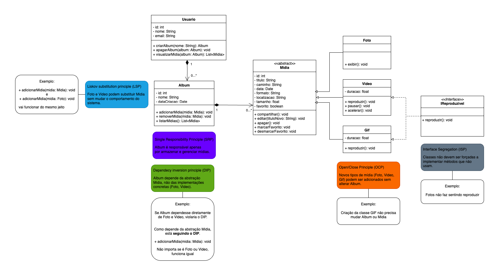

# 📚 Projeto Arquitetura de Sistemas - UNIFOR

Bem-vindo ao repositório do projeto desenvolvido para a disciplina **Arquitetura de Sistemas**.  
Aqui você encontrará as implementações práticas e diagramas aplicando os princípios **SOLID** em Java. 🚀

---

## 👨‍💻 Equipe

- **Anselmo Ferrer** - 2410414
- **Davi Uchôa** - 2410394
- **João Marcelo Parente** - 2410392
- **Thiago Victor Maranhão** - 2410413

---

## 📐 Diagrama de Classes (SOLID)

  

---

## 🛠️ Tecnologias Utilizadas
- Java ☕
- Git & GitHub 🌐

---

## 📌 Objetivo
O projeto tem como objetivo aplicar os conceitos de **arquitetura de software** e **princípios SOLID**, garantindo boas práticas de desenvolvimento e manutenção do código.  